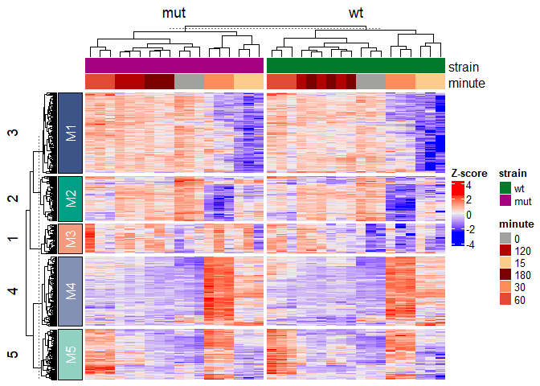
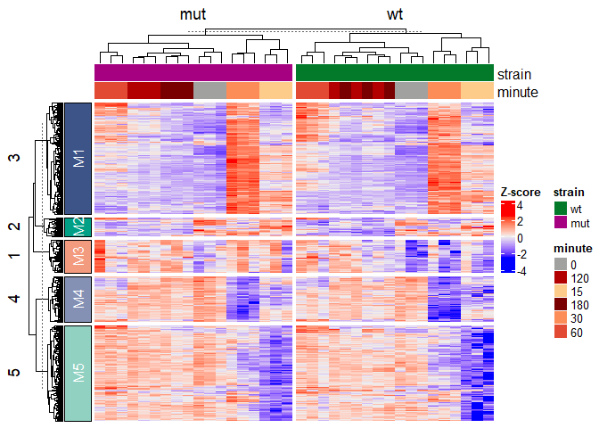

<!-- README.md is generated from README.Rmd. Please edit that file -->

# ADS8192 Heatmap Package

<!-- badges: start -->

[](https://github.com/akaur40/ADS8192/actions/workflows/R-CMD-check.yaml)
<!-- badges: end -->

This package provides tools for analyzing RNA-seq data from the fission
yeast stress response experiment. It includes functions to do the
following: - Normalize count data - Select top variable genes - Scale
expression matrices - Generate annotated heatmaps - Extract gene
modules - Export results

## Installation

You can install the development version of ADS8192 from
[GitHub](https://github.com/) with:

``` r
remotes::install_github("akaur40/ADS8192")
```

## Quick Start Guide

``` r
devtools::load_all()
#> ℹ Loading ADS8192
#> Warning: package 'testthat' was built under R version 4.5.3

#load example data
data("example_se", package = "ADS8192")

#Run full analysis
result <- run_heatmap_analysis(example_se)
```



``` r

#view output
result$heatmap
```


``` r
head(result$scaled_matrix)
#>               GSM1368273 GSM1368274 GSM1368275 GSM1368276 GSM1368277 GSM1368278
#> SPAC22A12.17c -1.1864909 -1.3880733 -1.0590725  0.3785982  0.3669586  0.3461664
#> SPAC23H3.15c  -1.5360323 -1.5247699 -1.4243292  0.7333195  0.6714982  0.7086884
#> SPBC660.05    -0.7029685 -0.9057978 -1.0368268  1.4941974  1.4451379  1.3242475
#> SPBC24C6.09c  -1.2567151 -1.6338357 -1.0598001  0.6513957  0.5396933  0.6287619
#> SPCPB16A4.07  -1.1419400 -1.1888846 -0.8287633  1.1583026  1.0744403  1.1173947
#> SPACUNK4.17   -1.7518472 -1.6130182 -1.5457258  0.6310616  0.6099901  0.8421375
#>               GSM1368279 GSM1368280 GSM1368281  GSM1368282 GSM1368283
#> SPAC22A12.17c   1.352677   1.366316  1.2542975  0.88339776  1.2994821
#> SPAC23H3.15c    1.630368   1.490610  1.4910764 -0.07701231  0.4548246
#> SPBC660.05      1.083546   1.280595  0.9211262 -0.80380980 -0.4477036
#> SPBC24C6.09c    1.596357   1.802446  1.7834487 -0.09514019  0.1436727
#> SPCPB16A4.07    1.600163   1.412343  1.4395206 -0.74121317 -0.3242169
#> SPACUNK4.17     1.416190   1.618818  1.6237901  0.10391214  0.3977222
#>                GSM1368284 GSM1368285 GSM1368286  GSM1368287 GSM1368288
#> SPAC22A12.17c  1.07855946 -0.4179828 -0.9785400 -0.45948470 -0.7012123
#> SPAC23H3.15c   0.06047980 -0.1973807 -0.6532320 -0.14474227 -0.4767343
#> SPBC660.05    -0.70025857 -0.5450986 -0.9423990 -0.66553952 -0.5110332
#> SPBC24C6.09c  -0.01649839 -0.1515764 -0.6797619  0.16910754 -0.4277256
#> SPCPB16A4.07  -0.44082243 -0.6484098 -0.8237513 -0.49628983 -0.6378668
#> SPACUNK4.17    0.23527873 -0.2259985 -0.5902900 -0.00399393 -0.3811920
#>                GSM1368289 GSM1368290 GSM1368291 GSM1368292 GSM1368293
#> SPAC22A12.17c -0.36945407 -0.9931303  -1.563694 -1.1973840 -0.8405493
#> SPAC23H3.15c  -0.09703858 -0.6210459  -1.769388 -1.8006570 -1.1043135
#> SPBC660.05    -0.56176956 -0.7142573  -0.875045 -0.9518366 -0.7673312
#> SPBC24C6.09c   0.06330341 -0.4184963  -1.764191 -1.8295729 -0.9452545
#> SPCPB16A4.07  -0.50126088 -0.7657615  -1.035099 -0.8843954 -0.7730759
#> SPACUNK4.17   -0.07040929 -0.2303600  -1.704993 -1.7876849 -1.2224015
#>               GSM1368294 GSM1368295 GSM1368296 GSM1368297 GSM1368298 GSM1368299
#> SPAC22A12.17c  0.3379515  0.1810043  0.3087035   1.340804   1.339124   1.495134
#> SPAC23H3.15c   0.7199094  0.5771376  0.6766638   1.577005   1.604713   1.712067
#> SPBC660.05     1.4196689  1.5387403  1.4802159   1.270635   1.734433   1.427626
#> SPBC24C6.09c   0.6164783  0.2969390  0.5111977   1.669006   1.618457   1.783226
#> SPCPB16A4.07   1.1437514  1.1349075  1.2030549   1.525374   1.748155   1.723888
#> SPACUNK4.17    0.6292054  0.4655715  0.6848970   1.505640   1.509102   1.652976
#>                GSM1368300  GSM1368301  GSM1368302 GSM1368303   GSM1368304
#> SPAC22A12.17c  0.97878915  1.00343989  1.01213036 -0.8194060 -0.642470958
#> SPAC23H3.15c  -0.07152756  0.05550987 -0.13537629 -0.2604829 -0.145909019
#> SPBC660.05    -0.76660286 -0.30714728 -0.80324935 -0.5481045 -0.526983138
#> SPBC24C6.09c  -0.39093121 -0.28807988 -0.28966004 -0.2427539 -0.004653822
#> SPCPB16A4.07  -0.58346285 -0.56277673 -0.54331478 -0.4230782 -0.443120352
#> SPACUNK4.17   -0.15779208  0.08731675 -0.06715894 -0.4646406 -0.138070992
#>               GSM1368305 GSM1368306 GSM1368307 GSM1368308
#> SPAC22A12.17c -0.7132849 -1.0772390 -0.7944650 -1.1216001
#> SPAC23H3.15c  -0.1187138 -0.6302985 -0.6844109 -0.6904754
#> SPBC660.05    -0.5542182 -0.5074658 -0.7841647 -0.4905582
#> SPBC24C6.09c  -0.2386738 -0.7578405 -0.6742784 -0.7080500
#> SPCPB16A4.07  -0.4275396 -0.6734949 -0.7244871 -0.6682695
#> SPACUNK4.17   -0.2921440 -0.4960274 -0.6859754 -0.5838842
head(result$gene_modules)
#>            gene module
#> 1 SPAC22A12.17c     M5
#> 2  SPAC23H3.15c     M4
#> 3    SPBC660.05     M4
#> 4  SPBC24C6.09c     M4
#> 5  SPCPB16A4.07     M4
#> 6   SPACUNK4.17     M4
```

\#Example with parameters

``` r
devtools::load_all()
#> ℹ Loading ADS8192
data("example_se", package = "ADS8192")

result <- run_heatmap_analysis(
  se = example_se,
  n_top = 500,
  scale_method = "zscore",
  gene_k = 5,
  column_split_by = "strain"
)
```



## Command Line Interface (CLI)

This package provides a command-line interface for running the analysis
Install the CLI launcher:

``` r
ADS8192::install_ads8192_cli()
#> created: C:\Users\akaur40\AppData\Local\Programs\R\Rapp\bin\ADS8192.bat (from package ADS8192)
```

CLI help:

``` bash
ADS8192 heatmap --help
```

Fallback development usage:

``` bash
Rapp exec/ADS8192.R heatmap --help
```

Example run:

``` bash
ADS8192 heatmap \
  --input example \
  --n_top 500\
  --scale_method zscore \
  --gene_k 5 \
  --column_split_by strain \
  --output_dir results/
```
